# stm32-inator
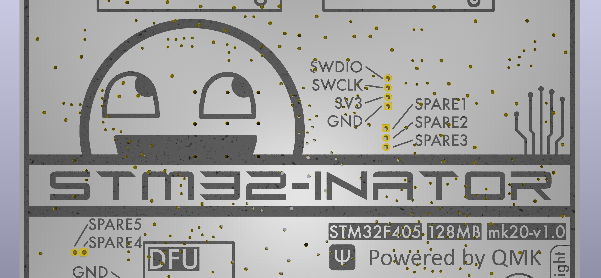

In the search for better performance, I moved from [RP2040](https://github.com/christrotter/mk19-rp2040) (`125mhz`) to STM32F405 (`168mhz`).  Getting familiar with STM32 also allows me more confidence to move to the H7** chips in future (`550mhz`).

`This board has been submitted for production at JLC (PCBA), but not tested yet.`

Many thanks to Drashna, burkfers, GeorgeN, badjeff, and the various people (tzarc) I snaggled stuff from - as always, these projects are a community effort.

# Features
- STM32F405RGTx w. crystal
- 128mb external flash via SPI
  - Because I Can™ by drashna® 
- FFC connections (mostly), using VIK-footprinted 12-pin 0.5mm pitch connectors
- Rough footprint is 60x60mm
- Designed for remote-mount USB and split-serial ports
- WS2812 signal conversion to 5v
- Two-stage DFU button, on-board for convenience, headers for an external button
  - Press for reset
  - Hold for ~4s to enter DFU mode for flashing
- Designed for Arcboard-mk20 peripherals
  - 4x dpad outputs (5rows, 1col, LED DI/DO, 5v/gnd)
  - 3x encoders outputs (encoder A/B, 3.3v/gnd)
  - 1x SPI PMW output (usual pins)
  - 1x SPI LCD output (usual pins)
  - 1x 25-pin Cyboard connector (0.3mm FPC connector for [Cyboard](https://www.cyboard.digital/product-page/dactyl-flex-pcbs) connectivity (or via [this](https://github.com/christrotter/mk19-flex-pcb)))
- 2-layer design for simplicity and cost

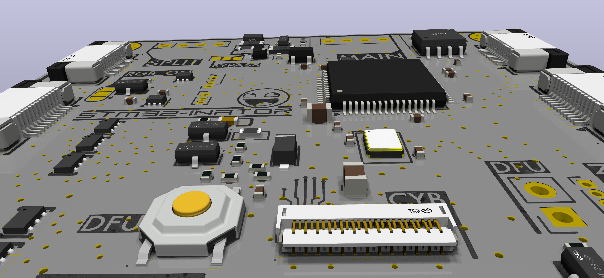

# Design notes & decisions
## CPU
I had originally wanted to go whole-hog and start with STM32H723 (as mentioned, 550mhz), but there are a lot of Chibios/QMK config bits to set that are not well-documented at present.  As 550mhz is super overkill for a keyboard, it's not a widely used chip - so examples are sparse or non-existent.

Drashna recommended starting with F405 and so who am I to second-guess them.

## Flash
At present (August 2025) QMK cannot support external flash for code execution, but feature work is on-going.  I was advised by Drashna to include the flash chip for future-proofing.  My hope is to use it for icon storage and the like.

Why 128mb?  Because it was a few bucks difference compared to 16mb, and there was no real (evident) reason not to.

## Remote-mount USB/split-serial port
This is mostly a mk20 design thing - I wanted to have the split-serial connector be at an angle, not coming off the back of the board.  When the ports are in the back, it's awkward to figure out which one is main, which one is split.  Drashna pointed out that he's been using [these](https://www.aliexpress.com/item/1005005997783735.html) which have 12cm cables and has no USB issues at all.  After a hiccup with JLC PCBA design review, I had to cancel the order and re-submit, and took the plunge...there was no room for both an on-board port and breakout pins.

  - JLC PCBA charges ~C$6 per usb port (per board...), and I've had soldering issues w. those components before
  - No more fuss with v-cut layer drama and them wanting me to use EasyEDA
  - I don't have a USB-C source, and I'm not selling this, so...whatever...
  - note that the remote-port needs to have 5.1k pull-down resistors on the CC lines to function on a USB-C host port

## Device/peripheral connectivity
I explicitly wanted to move away from JST-XH (or any soldered connector) because of pain issues doing all that soldering.  This board's goal was 'minimize soldering, maximize PCBA-ing'.

Given that I like the [VIK standard](https://github.com/sadekbaroudi/vik), I went with VIK footprints - 12-pin 0.5mm pitch FFC.  Not all of the pinouts are VIK-correct, but at least it keeps things somewhat standardized.

## Breakouts
To save space while also future-proofing, I was advised to include breakouts (thx GeorgeN/burkfers).

- Main USB & Split/serial via 2.54mm 4-pin header (I left room for a horizontal JST-XH socket)
- RGB data output via 2.54mm 3-pin header
- Reset, boot pins via 1.00mm 4-pin header
- 5 spare pins via 1.00mm 2-pin and 3-pin headers
- Debug pins via 1.00mm 4-pin header

## Spare pins
The 5 spare pins were initially going to be used for the matrix, but I cut out some features (RKJXT) and didn't need them.  They are available via headers.

Suggestions I've had:
- audio
- haptic

## Solder pads
There are a number of 'config' settings you can achieve using solder pads.  I had originally thought about using DIP switches or something...but burkfers counseled me to just stick with solder pads.

- Set [handedness](https://docs.qmk.fm/features/split_keyboard#handedness-by-pin)
- Bypass VBUS power safeties (I keep this in because I don't know what a fuse failure would look like)
- "turn on" power to the RGB and LCD mosfets

## PCB design
I decided to stick with a 2-layer stackup because I was already comfortable with using pours and vias to keep the ground plane consistent.  We'll see if that pans out.

It's important to note that if you don't provide for good ground pathing 2-layers is a bad choice.  It's "easier" to do a 4-layer board in that regard.

When ordering, I used the 'rails by JLC' option.

## Dimensions
[The RP2040 board](https://github.com/christrotter/mk19-rp2040) was `~125x75mm`, and burkfers challenged me to make this one more compact.  So a few design iterations in and we got `~60x60mm`... which unfortunately got mangled to `59.5x59.7mm`.  I'm still learning pcb design, and Kicad doesn't make it easy (or I have yet to learn the method) to keep things oriented/placed relative to center.

- 51.55mm hole spacing (square)
- M3 holes
- 59.5x59.7mm actual board size

## Matrix arrangement
I moved away from the SPI register design not because it was broken, but because you are effectively artificially limiting 'speed' with the SPI bus (sort of?).  I'm using `ROW2COL` because the Cyboard pcb's are designed this way.  

I decided to try diode "arrays" ([BAV70S - High-speed switching double diode](https://jlcpcb.com/partdetail/Nexperia-BAV70S115/C455031)) this time to save space.  However, this came with some fairly dramatic trace routing challenges.

- 6 rows
- 10 columns

## QMK
I mention `ROW2COL` and QMK not because ZMK or other won't work, but because it's what I am familiar with.

This board is intended to control half of a split keyboard, so you need two.

# Links
- [Datasheet for STM32F405](https://www.st.com/resource/en/datasheet/dm00037051.pdf)
- [Great article on STM32 DFU circuit](https://acheronproject.com/reset_article_1/reset_article_1/)
- [Great article on USB-C CC lines](https://hackaday.com/2023/01/04/all-about-usb-c-resistors-and-emarkers/)
- [TI pdf on USB-C power](https://www.ti.com/lit/wp/slyy109b/slyy109b.pdf)
- [USB and Type-C demystified](https://www.st.com/content/dam/AME/2019/technology-tour-2019/chicago/presentations/T1S3_Schaumburg_USB-Type-C_G.Gosciniak.pdf)
- [SPI flash on STM32](https://mischianti.org/stm32-add-spi-flash-memory-with-fat-fs/)

# BOM
|Designator                                  |Footprint                              |Quantity|Value               |LCSC Part #|
|--------------------------------------------|---------------------------------------|--------|--------------------|-----------|
|C1, C10, C20                                |0805                                   |3       |4.7uF               |C1779      |
|C11, C12, C14, C17, C18, C19, C5, C7, C8, C9|0402                                   |10      |100nF               |C1525      |
|C13, C15, C27                               |0402                                   |3       |1uF                 |C52923     |
|C2, C4                                      |0402                                   |2       |2.2uF               |C12530     |
|C22                                         |C0603                                  |1       |CL10A106MA8NRNC     |C96446     |
|C3, C6                                      |0402                                   |2       |12p                 |C1547      |
|CYBOARD-MAIN1                               |FPC-SMD_ECT818001569                   |1       |ECT818001569        |C711420    |
|D2                                          |D_SOD-323                              |1       |B5817               |C123899    |
|D4                                          |SOD-123FL_L2.8-W1.8-LS3.7-BI           |1       |SMF5_0CA_C364279    |C364279    |
|D5, D7                                      |SOT-666-6_L1.6-W1.2-P0.50-LS1.6-BL     |2       |USBLC6-2P6_C2827693 |C2827693   |
|F1                                          |F1206                                  |1       |Polyfuse            |C2892424   |
|F3                                          |F1206                                  |1       |MF-NSMF075-2        |C89653     |
|J13, J14, J15, J16, J3, J4, J6, J7, J8      |FFC-SMD_FFC05001-12SBA124W5M           |9       |FFC05001-12SBA124W5M|C2833760   |
|L1                                          |L0805                                  |1       |MPZ2012S101AT000    |C15957     |
|LED-LVL1                                    |SOT-563_L1.6-W1.2-P0.50-LS1.6-BR       |1       |SN74LVC1T45DRL      |C352970    |
|MOSFET1, MOSFET2, MOSFET3                   |SOT-23_L2.9-W1.3-P1.90-LS2.4-BR        |3       |AO3401A             |C15127     |
|R1                                          |0402                                   |1       |0402WGF1004TCE      |C26083     |
|R10                                         |0402                                   |1       |5.1k                |C25905     |
|R11, R12, R16, R2, R3, R7, R8               |0402                                   |7       |10k                 |C25744     |
|R14                                         |0402                                   |1       |0402WGF1000TCE      |C25076     |
|R15                                         |0402                                   |1       |0402WGF1001TCE      |C11702     |
|R6                                          |R0603                                  |1       |0603WAF3303T5E      |C23137     |
|R9                                          |0402                                   |1       |0402WGF1003TCE      |C25741     |
|U1                                          |SOT-23-5                               |1       |XC6210B332MR-G      |C82942     |
|U10                                         |SOD-123F_L2.7-W1.6-LS3.8-RD            |1       |1N4148W_C81598      |C81598     |
|U13, U4                                     |SOT-23-3_L2.9-W1.3-P1.90-LS2.4-BR      |2       |2N7002              |C8545      |
|U14                                         |SOIC-8_L5.3-W5.3-P1.27-LS8.0-BL        |1       |W25Q128JVSIQTR      |C97521     |
|U15                                         |SW-SMD_4P-L5.1-W5.1-P3.70-LS6.5-TL_H1.5|1       |TS-1187A-B-A-B      |C318884    |
|U3                                          |LQFP-64_10x10mm_P0.5mm                 |1       |STM32F405RGTx       |C15742     |
|U5, U6, U7, U8, U9                          |SOT-363-6_L2.0-W1.3-P0.65-LS2.1-BL     |5       |BAV70S,115          |C455031    |
|Y1                                          |CRYSTAL-SMD_4P-L3.2-W2.5-BL-1          |1       |Crystal_GND24       |C518154    |

# Layout
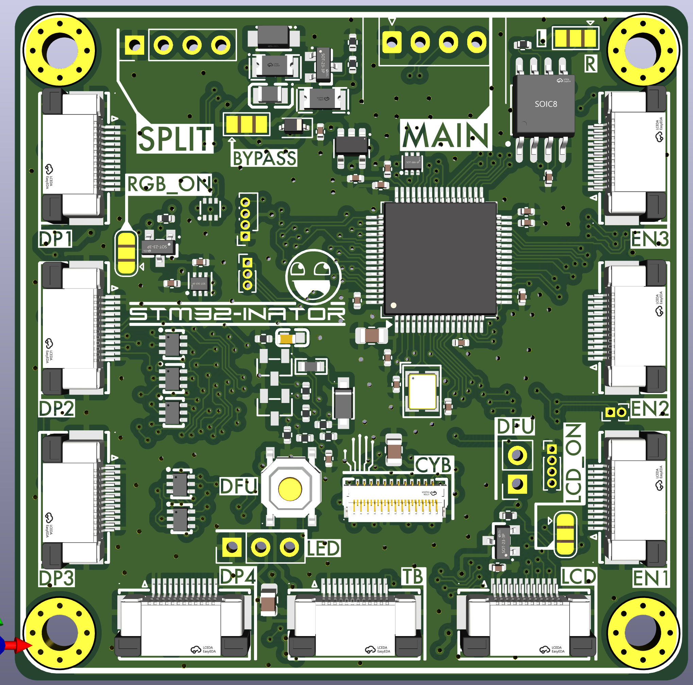
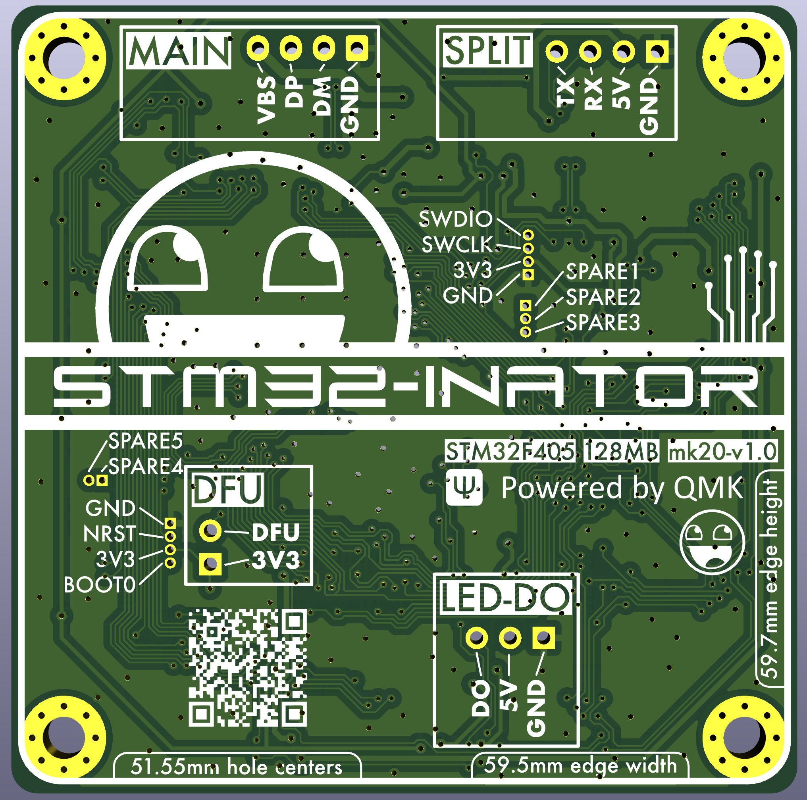

# PCB overview
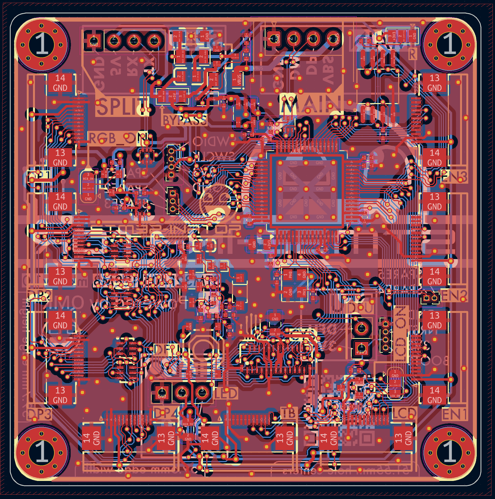

# Schematic
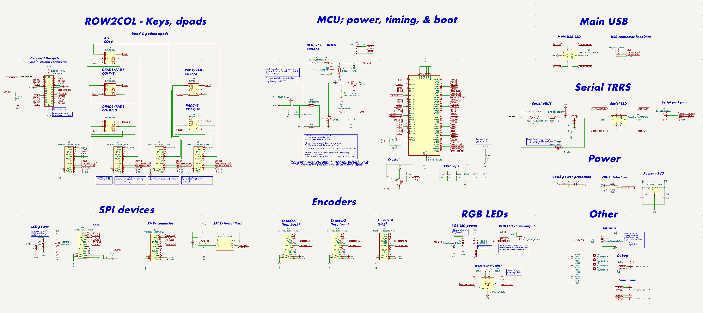

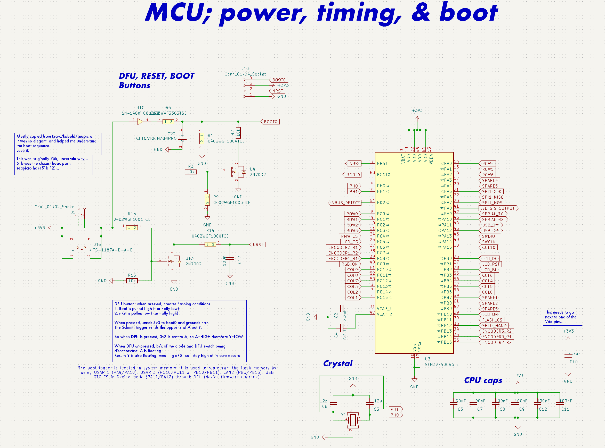

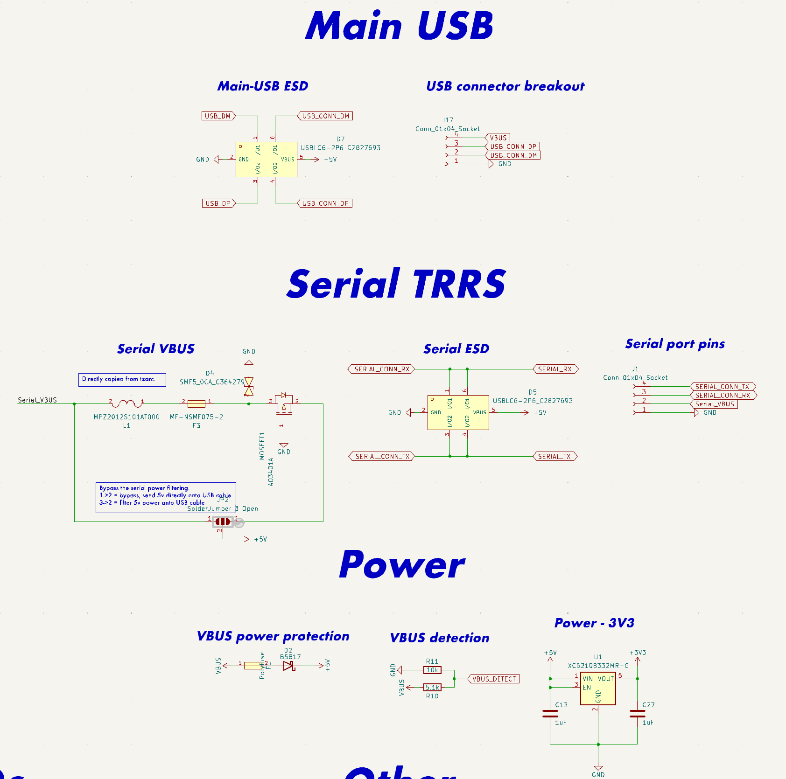

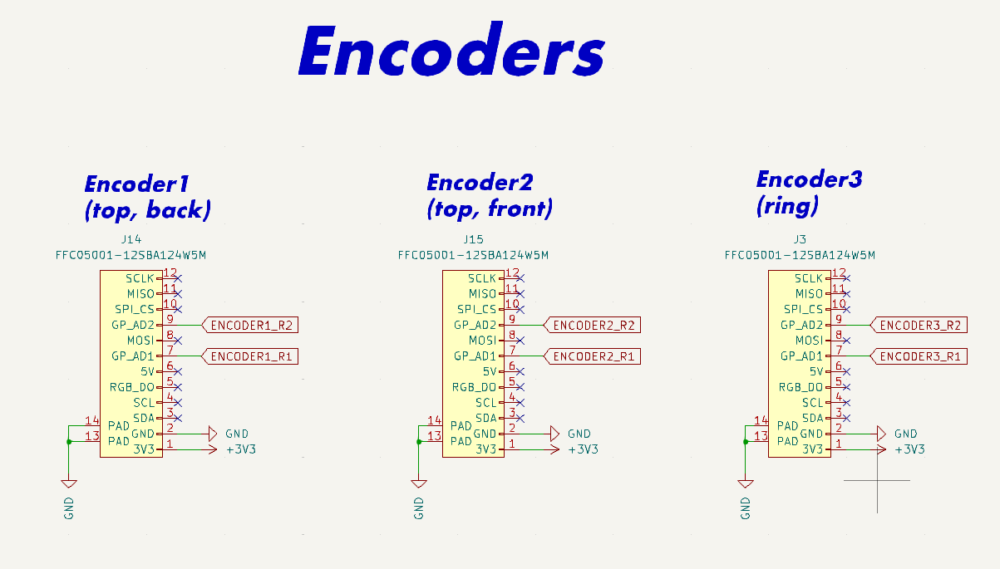

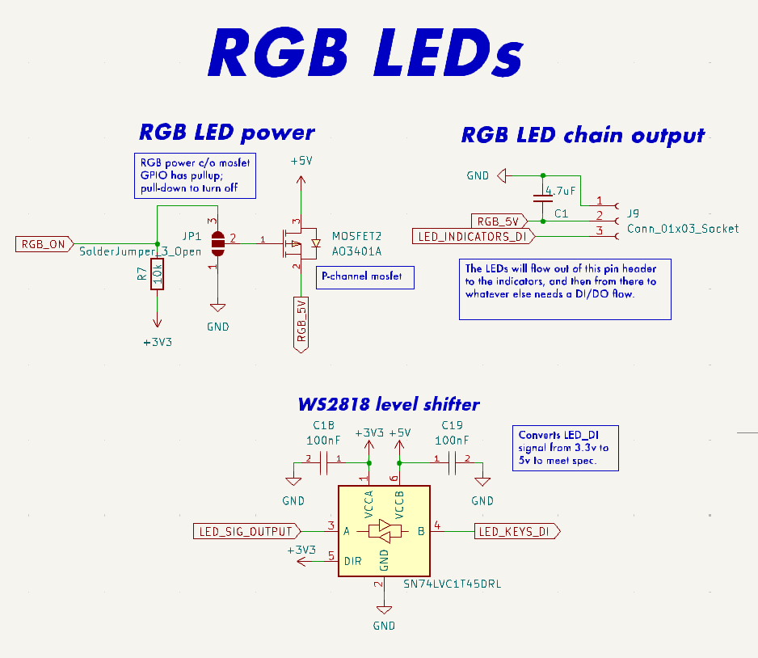

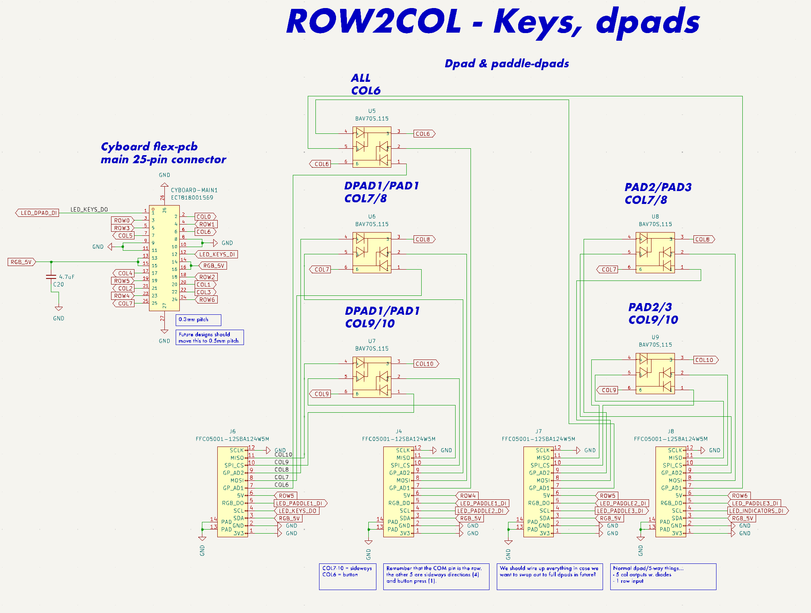

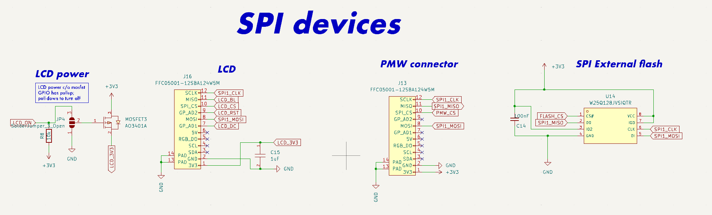

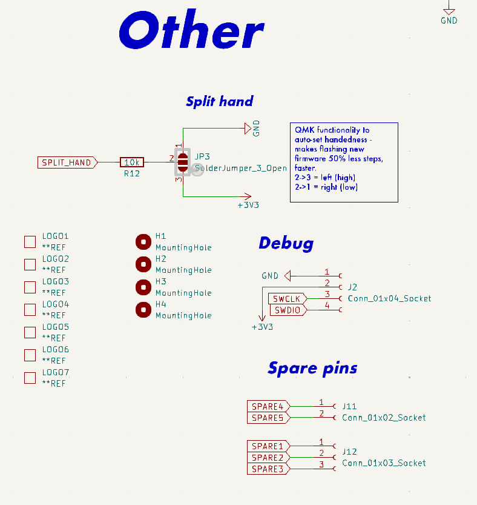
